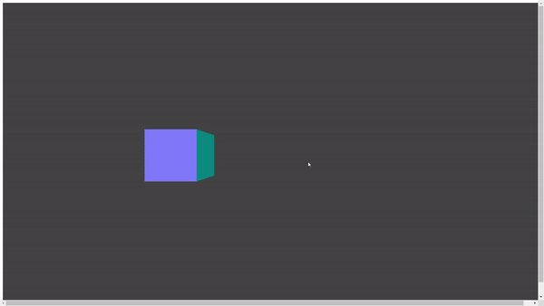
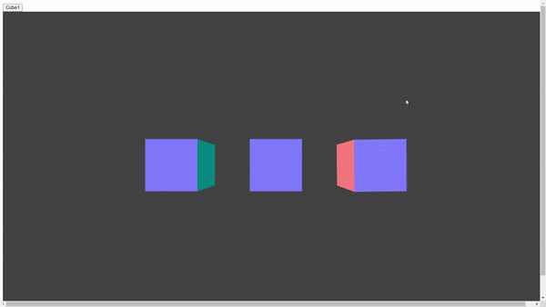

# CG Tutorial
MIT.LICENSE\
201620941 조재성

## Object rotate and Camera rotate

본 컨텐츠는 Object가 rotate하게 보이게 Camera의 위치를 바꾸는 방법과 직접 Object를 돌리는 방식에 대해 설명합니다.\
이제 단계별로 어떤 방식으로 화면의 Cube들이 돌아가는지 알아보겠습니다.\
코드에 대한 자세한 설명은 index.html참고 바랍니다.

### Cube1

우선 기본 설정을 맞춘 뒤에, BoxGeometry을 통해 Cube를 하나 만듭니다.\
다음으로 큐브는 건드리지 않고, Camera을 위치를 조금씩 바꾸면서 랜더링해, 마치 큐브가 움직이는 것처럼 보이게 합니다.\
\

### Cube2

다음은 Camera는 계속 움직인 상태에서 Cube2를 추가합니다.\
이번에는 Camera를 건드리지 않고, Cube2의 rotation값만 변경해서 혼자서 rotate하게 만들어 줍니다.\
이렇게 설정하면, 정적인 상태에서 보이는 위치만 바뀌는 기존의 Cube와 달리 혼자서 Rotate하는 Cube2를 볼 수 있습니다.\

### Cube3

마지막으로 마우스로 rotate하는 Cube3를 추가합니다.\
마우스로 클릭했을 때의 좌표값이랑 움직일때의 좌표값의 차이를 이용해 Cube3를 rotation하게 함으로 마우스로 큐브를 돌릴 수 있도록 합니다.\

## 시행 착오 및 미쳐 구현하지 못한 기능

원래 목표는 앞서 언급한 방법들에 추가로, Mouse를 통해 Object를 돌리고, 버튼을 누르면 Object는 안 돌아가고, Camera만 돌아가게 하는 것까지가 목표였습니다.\
하지만 다양한 난관들에 봉착하면서 구현하지 못했습니다.

### OrbitControls

처음에는 Camera의 궤도를 Mouse를 통해 움직이기 위해 OrbitControl을 사용했습니다.\
이것을 사용하면 Mouse에 움직임에 맞춰 Camera도 움직일 수 있어서 해당 주제를 설명하기 안성맞춤이었습니다.\
하지만, Mouse를 움직이면 Object랑 Camera 둘 다 동시에 움직이는 문제가 발생하였습니다\
두 기능에서 선택해서 따로 움직이게 하기 위해 많은 시간과 노력을 했지만 실패하면서, 결국 두 기능 중 하나는 자동으로 작동하게 구현하기로 했습니다.\

### Raycaster

다른 방법으로는 Raycaster를 이용해, Cube를 선택한 경우에만 Cube가 돌아가고, Cube 바깥을 선택하면 Camera가 돌아가게 구현하려고 했습니다.\
하지만 Object를 Pick하는 문제는 생각보다 복잡해서, 아쉽지만, 좀 더 간단한 방법을 선택하게 되었습니다.\

## 느낀 점

결과적으로 들인 노력과 시간에 비해 부족한 결과물이 나와서 많은 아쉬움이 남습니다.\
구현하다 보니 다양한 기능들을 알게 되고, 그러면서 욕심이 생기다 보니 계속 만족을 못하고 기능을 추가하고 싶었습니다,\
결국 제한된 시간내에 원하는 기능을 전부 집어 넣지 못해서 아쉽습니다.\
비록 결과는 만족스럽지 못해도, 정말 오랜만에 열정적으로 밤 늦게까지 코딩하는 재미를 느낄 수 있었습니다.

# References

https://threejs.org/docs/index.html#api/en/materials/MeshNormalMaterial \
https://threejs.org/docs/index.html#api/en/constants/Materials \
https://threejs.org/docs/index.html#api/en/cameras/PerspectiveCamera \
https://discourse.threejs.org/t/rotate-gltf-object-based-on-the-position-of-mouse/29213 \
https://threejs.org/docs/index.html#examples/en/controls/OrbitControls \
https://hianna.tistory.com/492 \
https://velog.io/@9rganizedchaos/Three.js-journey-%EA%B0%95%EC%9D%98%EB%85%B8%ED%8A%B8-12 \
https://jsfiddle.net/vcx5e4g6/ \
https://threejs.org/examples/#webgl_interactive_cubes

